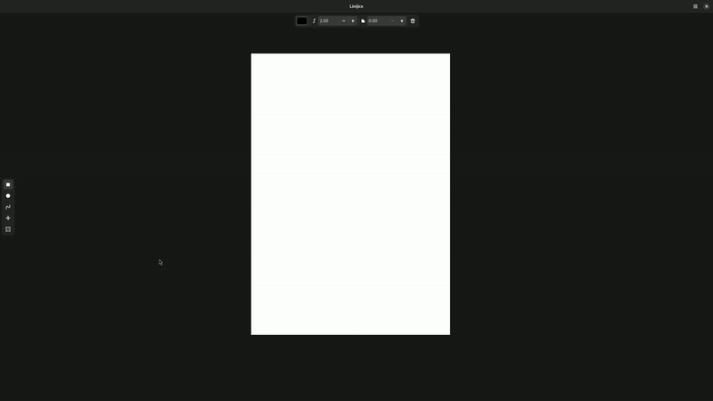

# Linijice - vector art program

Projekat iz predmeta programske paradigme na Matematičkom fakultetu.

Program je razvijen u programskom jeziku [hare](https://harelang.org) i omogućava vektorsku obradu sklika.

Podržane akcije su kreiranje pravougaonika, elipsi i bezijeovih krivih, njihovo selektovanje, menanje boja, pomeranje i brisanje.

Dodatno, program omogućava čuvanje i učitavanje prethodno sačuvanog sadržaja.

## Pokretanje:

Za pokretanje nepohodan je GNU make, hare kompajler i biblioteke hare-gi i hare-xml.

```
$ make run
```

S obzirom da se jezik brzo razvija i teško je uskladiti verzije svih biblioteka i kompajlera, preporučljivo je koriščenje [flatpak](https://flatpak.org/) pakovanja paketa.

```
$ make flatpak-run
```



---
Ana Mijović, 59/2021   
Jana Botorić, 87/2021   
Petar Radojević, 156/2021
